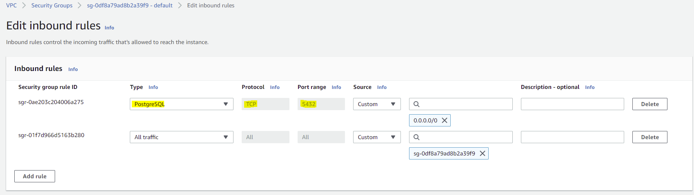
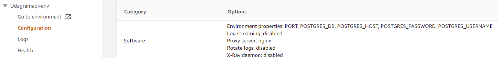
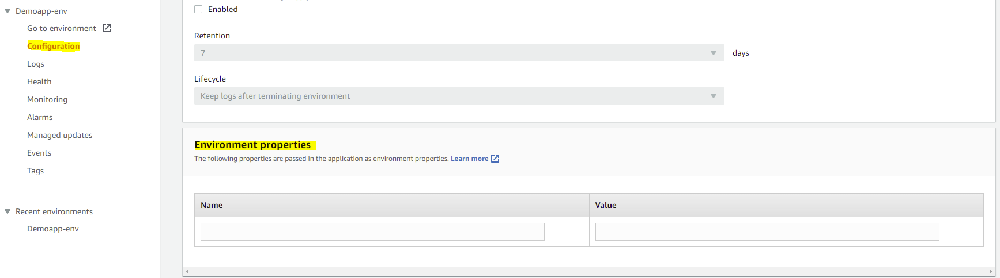
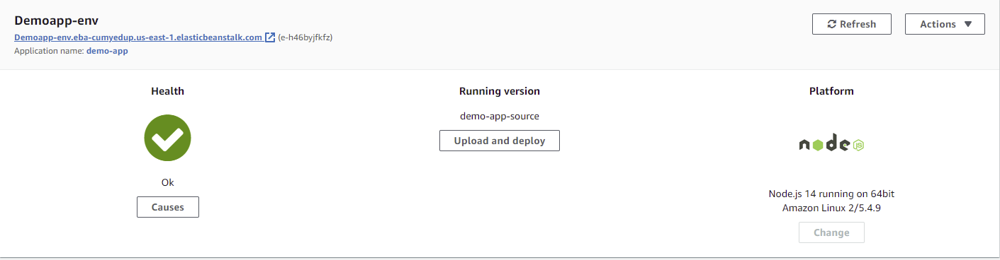
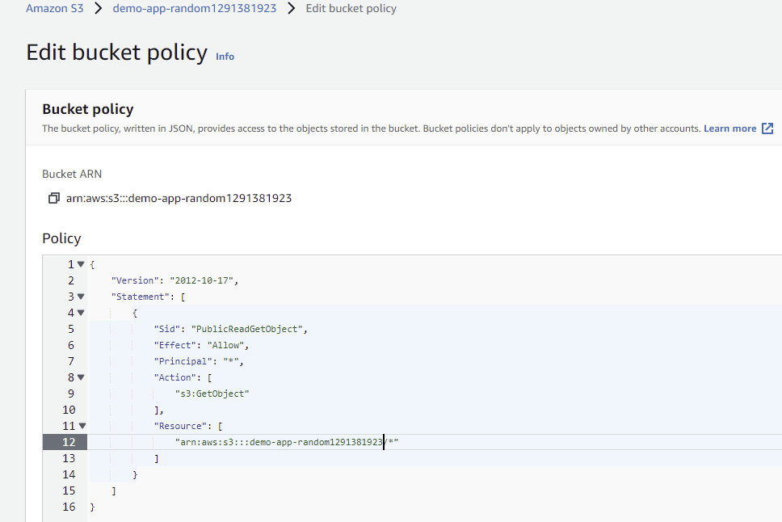
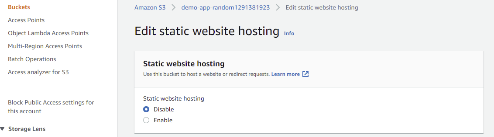
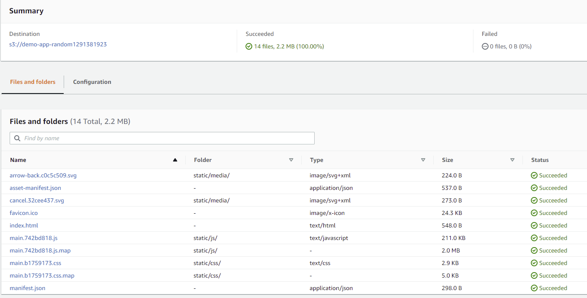
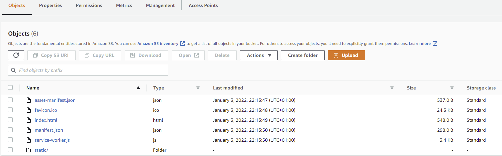

# Udagram

This application is provided to test and setup a DevOps Pipeline for the integration and deployment of a fullstack application using CircleCI and AWS.

## Build Status

[](https://app.circleci.com/pipelines/github/Mttds/DevOps-Pipeline-CircleCI?filter=all)

## Getting Started

1. Clone this repo locally into the location of your choice.
2. Open a terminal and navigate to the root of the repo
3. follow the instructions in the installation step

### Dependencies

```
- Node v14.15.1 (LTS) or more recent. While older versions can work it is advisable to keep node to latest LTS version

- npm 6.14.8 (LTS) or more recent

- AWS CLI v2, v1 can work but was not tested for this project. The eb (elastic beanstalk) cli is also used even if the aws cli can replace the commands executed by the eb cli. Use `aws configure` to setup the aws cli after the download. To do so you should first configure an IAM key to access the aws account programmatically (i.e with the cli): https://docs.aws.amazon.com/cli/latest/userguide/cli-configure-quickstart.html#cli-configure-quickstart-config

https://docs.aws.amazon.com/elasticbeanstalk/latest/dg/eb-cli3-install-advanced.html

https://docs.aws.amazon.com/cli/latest/userguide/getting-started-install.html

- A RDS database running Postgres. 

- A S3 bucket for hosting static files.

```

### AWS RDS database (postgresql)

After configuring the database on AWS RDS remember to check the inbound rules to allow TCP connections on port 5432 (default for postgresql) coming from any IPV4 address. To troubleshoot connection issue you can run the command `telnet <aws-rds-host> <port>`.



To check the connection from postgresql cli (psql) you can run: `psql --host=example.amazonaws.com --port=5432 --username=postgres --password --dbname=postgres` and you will be prompted for the password to login remotely.

You can also check: https://docs.aws.amazon.com/AmazonRDS/latest/UserGuide/USER_ConnectToPostgreSQLInstance.html#USER_ConnectToPostgreSQLInstance.psql

For the udagram-api application you need to setup the following environment variables (or variables in an .env file in the udagram-api root directory):

* POSTGRES_USERNAME=username
* POSTGRES_PASSWORD=password
* POSTGRES_DB=dbname
* PORT=port
* POSTGRES_HOST=hostname

In AWS ElasticBean server they can be configured in the Environment/Configuration/Software section under Environment properties.



### Elastic Beanstalk application server (running Node.js)

You should configure the API keys, passwords, etc as environment variables for the application server using the configuration provided by elastic beanstalk.



The application environment should be visible and have OK as status in the AWS console. By clicking the link on the AWS console environment you will be redirected to the webapp.

The entire zipped udagram-api folder should be uploaded to the elastic beanstalk applications server. The Archive.zip can be created with the build npm script in package.json: `npm run build`



### S3 for webhosting (server where the public files such as, js, css, and html are hosted)

In the configuration options make sure to enable static web hosting and public read access using the following ACL definition (configured for the appropriate aws S3 server hostname). This ACL file makes sure that public writes are not allowed (i.e nobody can modify the public files on the server), whereas public read access is allowed:

```
{
    "Version": "2012-10-17",
    "Statement": [
        {
            "Sid": "PublicReadGetObject",
            "Effect": "Allow",
            "Principal": "*",
            "Action": [
                "s3:GetObject"
            ],
            "Resource": [
                "arn:aws:s3:::example.com/*"
            ]
        }
    ]
}
```



When web hosting is enabled, remember to specify the Index document field (usually with index.html).



Upload the public files to the S3 bucket.



You should now be able to see them as Objects in the S3 bucket and in Properties you should find the URL for the website.



### Installation

Provision the necessary AWS services needed for running the application:

1. In AWS, provision a publicly available RDS database running Postgres.
2. In AWS, provision a s3 bucket for hosting the uploaded files.
3. Export the ENV variables needed or use a package like [dotnev](https://www.npmjs.com/package/dotenv)/.
4. From the root of the repo, navigate udagram-api folder `cd udagram-api` to install the node_modules `npm install`. After installation is done, start the api in dev mode with `npm run dev`.
5. Without closing the terminal in step 1, navigate to the udagram-frontend `cd udagram-frontend` to intall the node_modules `npm install`. After installation is done start the api in dev mode with `npm run start`.


### Infrastructure

[Infrastructure Documentation](./doc/Infrastructure/README.md)

### DevOps Pipeline

[CICD Pipeline](./doc/Pipeline/README.md)

## Testing

This project contains two different test suite: unit tests and End-To-End tests(e2e). Follow these steps to run the tests.

1. `cd udagram-frontend`
2. `npm run test`
3. `npm run e2e`

There are no Unit test on the back-end

### Unit Tests:

Unit tests are using the Jasmine Framework.

### End to End Tests:

The e2e tests are using Protractor and Jasmine.

## Built With

- [Angular](https://angular.io/) - Single Page Application Framework
- [Node](https://nodejs.org) - Javascript Runtime
- [Express](https://expressjs.com/) - Javascript API Framework
