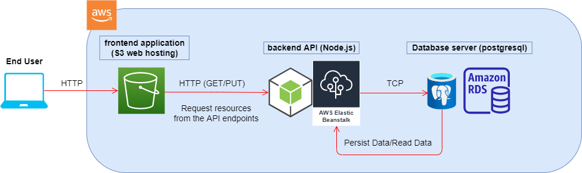
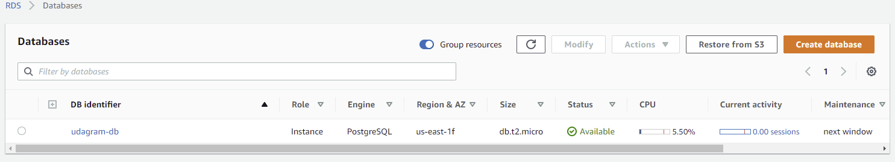
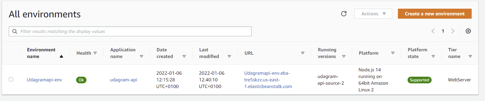
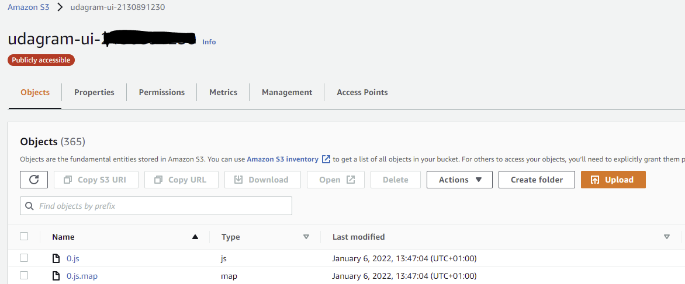

# Infrastructure

The infrastructure of the application is divided into 3 parts:

1) Database (backend)
2) Application Server (backend)
3) Website hosting (frontend)

The database is an AWS RDS (Relational Database Service) server running postgres.

The application server is an Elastic Beanstalk instance running Node.js.

The website hosting is an S3 Bucket for hosting js, css, html files publicly.

