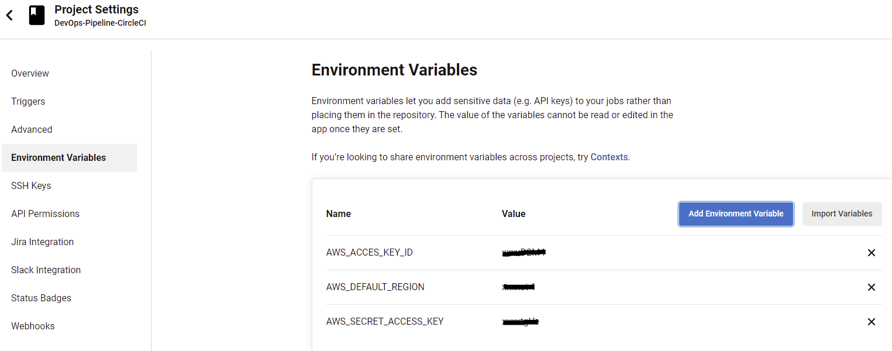
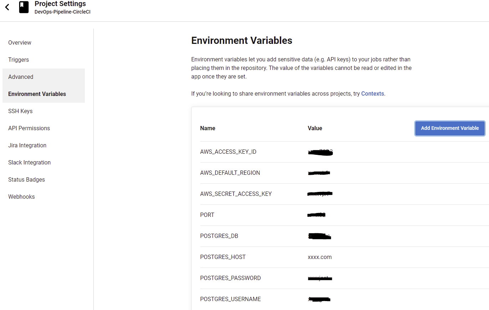

# CICD Pipeline

The CICD implementation uses CircleCI as a cloud-based platform for DevOps.

Deployment of the frontend is done using udagram-frontend/bin/deploy.sh called by npm script "deploy" (npm run deploy).
The script uses the aws cli to upload the content of the udagram-frontend/www folder (generated by npm run build) to the S3 bucket.

Deployment of the backend is done using udagram-api/bin/deploy.sh called by npm script "deploy" (npm run deploy).
The script uses the eb cli (elastic beanstalk) to upload the Archive.zip (created in the udagram-api/www folder using npm run build) and also sets the environment variables needed in the application server to connect to the AWS RDS instance.

In order to be able to use the aws cli with the configured IAM user for programmatic access, the following environment variables need to be configured in CircleCI in the Environment Variables section of the desired project (linked through GitHub).

We also set-up the environment variables for the database connection, so they will be set automatically on the elastic beanstalk server during the deployment script with `eb setenv key=value`.

The steps for the Pipleline are:

* setup of a docker image (container)
* installation of a node.js environment
* installation of the aws cli using the provided Environment Variables for access
* setup of the frontend dependencies with the install script
* setup of the backend dependencies with the install script
* build of the frontend with the build script
* build of the backend with the build script
* deployment of the frontend public files with the aws-cli to the configured S3 bucket